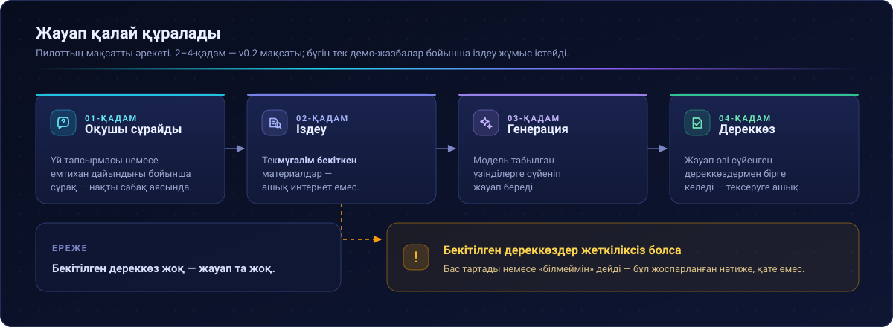
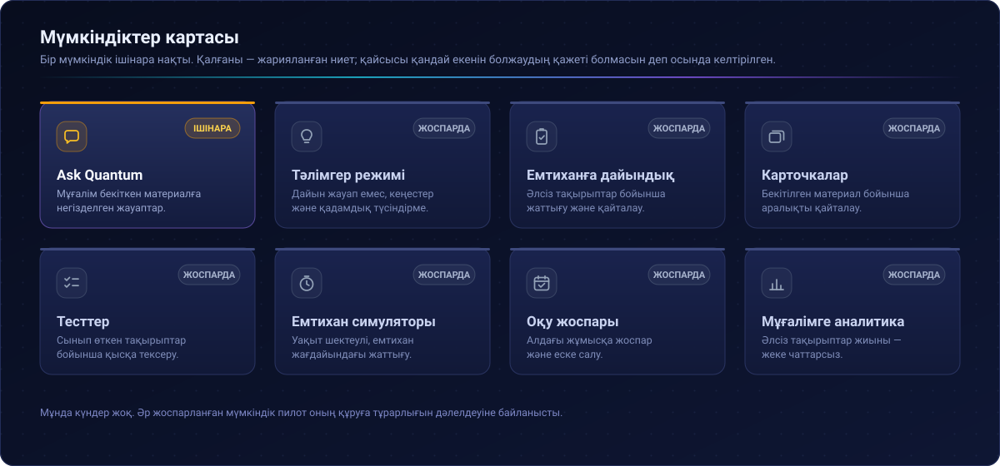
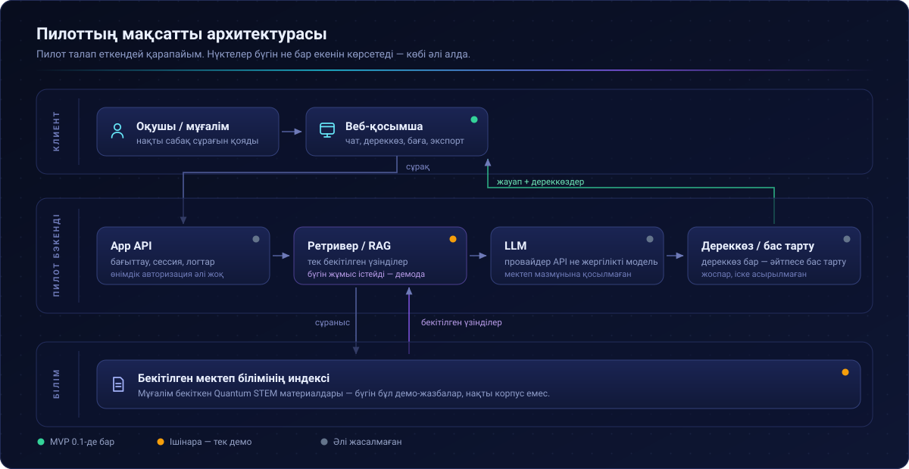
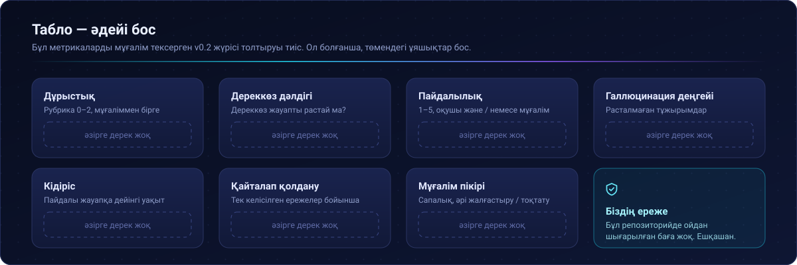
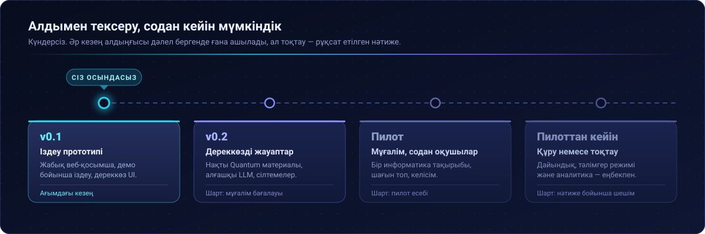
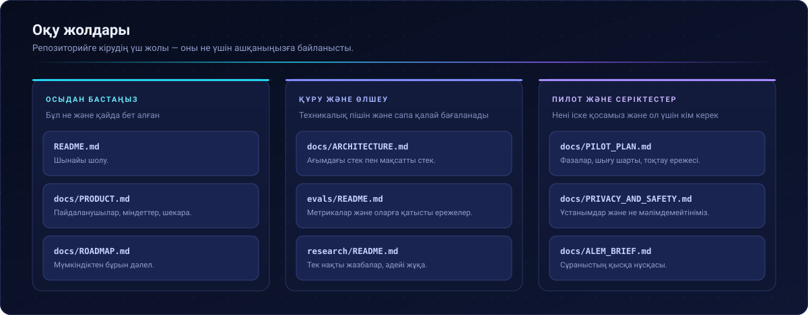

<div align="center">



<br>

[](docs/ROADMAP.md)
[](#ағымдағы-mvp)
[](docs/ARCHITECTURE.md)
[](#ағымдағы-күй)
[](LICENSE)

[English](README.md) · [Русский](README.ru.md) · **Қазақша**

**[Шолу](#шолу)** · **[Қалай жұмыс істейді](#қалай-жұмыс-істейді)** · **[Ағымдағы MVP](#ағымдағы-mvp)** · **[Архитектура](#архитектура)** · **[Пилот](#пилот)** · **[Бағалау](#бағалау)** · **[Жол картасы](#жол-картасы)** · **[Серіктестік](#серіктестік)**

</div>

---

> [!IMPORTANT]
> **Күй: техникалық MVP → пилот алды.** Өнімдік емес. Ауқымда тексерілмеген. Product–market fit мәлімделмейді.
>
> **Жабық сынақ прототипі (өнімдік емес):** [school-ai-lab демосы](https://school-ai-lab.proud-spice-8211.chatgpt.site)

## Шолу

Оқушылар үй тапсырмасы мен емтиханға дайындық үшін жалпы ЖИ құралдарын әлдеқашан қолданып жүр. Бірақ ол құралдар нақты мектептің бағдарламасын, мұғалім бекіткен конспектілерді және тақырыпты мектепте қалай түсіндіретінін білмейді.

School AI тарырақ тәсілді сынап көреді: **алдымен бекітілген мектеп білімінен ізде, сосын дереккөзі бар жауап құрастыр.** Ашық интернеттен жауап берудің орнына жүйе бір мектептің мұғалім бекіткен оқу материалдарына сүйенеді, дереккөздерді көрсетеді және ол материалдар жеткіліксіз болғанда бас тартудың анық жолы бар.

Өнім әдейі **бір мезгілде бір мектеппен** шектелген. Алғашқы енгізу — **Quantum STEM мектебі** үшін **Quantum AI**.

## Қалай жұмыс істейді



Қалғанының бәрі осы ережеден шығады: **бекітілген дереккөз жоқ болса — сенімді жауап та жоқ.** Мұнда бас тарту — қате емес, жоспарланған нәтиже.

> [!NOTE]
> 2–4-қадам пилоттың **мақсатты** әрекетін сипаттайды. Бүгін тек демо-жазбалар бойынша іздеу жұмыс істейді. Нақты Quantum материалдарына сүйенген жауаптар — **v0.2** мақсаты.

## Алғашқы енгізу: Quantum AI

Бір мектептен бастау білім қорын шағын, тексеруге болатын және нақты сабақтарға сай ұстауға мүмкіндік береді. Quantum STEM пилоттың алғашқы нысанасы ретінде таңдалды: онда информатика бойынша нақты бағдарлама, белгілі мұғалімдер және мектеп материалдарына негізделген жауаптар шынымен жалпы чат-боттан пайдалырақ па екенін тексеруге болатын бақыланатын орта бар.

> [!WARNING]
> Бұл репозиторийде ешқандай ресми серіктестік келісімі мәлімделмейді. Quantum STEM-мен пилоттық ынтымақтастық — біз **ұмтылып жатқан** нәрсе.

## Мәселе

Төменде — дәлелденген фактілер емес, **тексеруге тиіс гипотезалар**:

| ID | Гипотеза |
| :--- | :--- |
| **H1** | Жалпы ЖИ-ге нақты мектептің материалдары мен оқыту тәсілінің контексті жетіспейді. |
| **H2** | Оқушылар үй тапсырмасы мен емтиханға дайындықта ЖИ-ді сабақтан тыс әлдеқашан қолданады. |
| **H3** | Мұғалім бекіткен материалдар мен сілтемелер ЖИ-ді мектеп үшін пайдалырақ әрі басқарылатын етеді. |
| **H4** | Емтиханға дайындық (жаттығу, әлсіз тақырыптар, қайталау) негізгі қайталанатын сценарий бола алады. |
| **H5** | Материалдар қолжетімді болғанда, бір мектеп аясындағы RAG-жүйе мектеп міндеттерінде жалпы чат-боттардан асып түсе алады. |

Тәуелсіз бағалау мен мұғалім пікірі растамайынша, біз оқу нәтижесінің жақсарғанын, кең қолданысқа енгенін немесе ChatGPT-ден артықтығын мәлімдемейміз.

## Өнім



Қарастырылып жатқан бағыттар — бәрі ағымдағы MVP-ге кірмейді:

| Мүмкіндік | Ниет | MVP 0.1 |
| :--- | :--- | :--- |
| **Ask Quantum** | Оқушы сұрақ қояды; жауаптар бекітілген мектеп материалдарына сүйенеді | 🟠 Ішінара (демо-жазбалар / прототип UX) |
| **Тәлімгер режимі** | Дайын жауап емес, кеңестер мен қадамдық түсіндірме | ⚪ Іске асырылмаған |
| **Емтиханға дайындық** | Емтиханға арналған жаттығу сценарийлері | ⚪ Іске асырылмаған |
| **Карточкалар** | Бекітілген материал бойынша аралықты қайталау | ⚪ Іске асырылмаған |
| **Тесттер** | Өтілген тақырыптар бойынша қысқа тексеру | ⚪ Іске асырылмаған |
| **Емтихан симуляторы** | Уақыт шектеулі / құрылымдалған емтихан жаттығуы | ⚪ Іске асырылмаған |
| **Оқу жоспары / еске салу** | Жоспарлау және еске салу | ⚪ Іске асырылмаған |
| **Мұғалімге аналитика** | Әлсіз тақырыптар / қайталанатын сұрақтар жиыны (әдепкіде жеке чаттарсыз) | ⚪ Іске асырылмаған |

Пайдаланушылар, міндеттер және анық шекаралар: **[docs/PRODUCT.md](docs/PRODUCT.md)**.

## Ағымдағы MVP

<table>
<tr>
<td width="50%" valign="top">

### ✅ Іске асырылған — техникалық MVP 0.1

- Чат интерфейсі бар жабық веб-прототип
- **Демо-жазбалар** бойынша іздеу *(әзірге бекітілген Quantum STEM корпусы емес)*
- Интерфейсте ашылатын дереккөздер
- Пайдалылықты бағалау
- Сессияны экспорттау

</td>
<td width="50%" valign="top">

### ⬜ Әзірге іске асырылмаған / тексерілмеген

- Нақты мектеп мазмұнында өнімдік деңгейдегі қосылған **LLM**
- Білім қоры ретінде **бекітілген Quantum STEM** материалдары
- Нақты оқушылармен браузерде тексеру
- Мұғалімнің тәуелсіз бағалауы
- Тәлімгер режимі, емтиханға дайындық жиынтығы, мұғалімге аналитика

</td>
</tr>
</table>

> [!NOTE]
> **Шынайы атауы:** MVP 0.1 — демо-мазмұны бар, іздеуге бағытталған прототип. Нақты Quantum материалдарына сүйенген жауаптар — **v0.2** мақсаты.

## Архитектура



- **Қазір (0.1)** — веб-қосымша және демо-жазбалар бойынша іздеу; LLM жолы байланысқан мектеп пилот стегі ретінде тексерілмеген.
- **Мақсатты пилот** — бекітілген Quantum материалдары → іздеу → сілтемелермен генерация → дереккөз жеткіліксіз болса бас тарту.

Егжей-тегжейі және «жергілікті не бұлт» таңдауы: **[docs/ARCHITECTURE.md](docs/ARCHITECTURE.md)**.

## Пилот

**Quantum STEM**-де ұсынылып отырған алғашқы пилот, мектеп келісімі шартымен:

| | |
| :--- | :--- |
| **Пән** | Информатика — шағыннан бастау |
| **Мұғалімдер** | 1–2 |
| **Оқушылар** | Шағын топ |
| **Материалдар** | Тек мұғалім бекіткен |
| **Бенчмарк** | Тәуелсіз сұрақтар жиыны |
| **Кері байланыс** | Оқушылардан *және* мұғалімдерден құрылымды түрде |

Толық фазалар, шығу шарттары мен тоқтау ережелері: **[docs/PILOT_PLAN.md](docs/PILOT_PLAN.md)**.

## Бағалау



Жоспарланған метрикалар — **бұл репозиторийде ойдан шығарылған баға жоқ**:

| Метрика | Ескертпе |
| :--- | :--- |
| Дұрыстық | Рубрика, мысалы 0–2 |
| Дереккөз дәлдігі | Сілтеме жасалған материал жауапты шынымен растай ма? |
| Пайдалылық | 1–5 |
| Галлюцинация / қате деңгейі | Расталмаған тұжырымдар |
| Кідіріс | Жауапқа дейінгі уақыт |
| Қайталап қолдану | Тек этикалық журналдау болса |
| Мұғалім пікірі | Сапалық, әрі «жалғастыру / тоқтату» |

Бағалау харнесі туралы жазбалар: **[evals/README.md](evals/README.md)**.

## Құпиялылық

Пилот алдындағы жұмыстың негізгі ұстанымдары:

- **Деректерді барынша азайту**
- Оқушының жеке деректерін жинағанша, бекітілген оқу материалдарын таңдау
- Ерте бағалау үшін анонимді / мұғалім берген сұрақтар
- Оқушының артық идентификаторлары жоқ
- Оқушылармен кеңейтілген пилот — **тек** мектеппен келісім және анық дерек саясаты болғаннан кейін

Толық ұстанымдар: **[docs/PRIVACY_AND_SAFETY.md](docs/PRIVACY_AND_SAFETY.md)**.

## Ағымдағы күй

```text
Идея  →  Техникалық MVP  →  Пилот алды  →  (кейін) Пилот нәтижелері
                  ▲
             сіз осындасыз
```

| Мәлімдеме | Күй |
| :--- | :--- |
| Жұмыс істейтін жабық прототип | ✅ Иә — демо-жазбаларда |
| Нақты Quantum корпусы + LLM пилоты | ⬜ Әзірге жоқ |
| Өнімдік енгізу | ❌ Жоқ |
| Расталған оқу нәтижелері | ❌ Жоқ |
| Product–market fit | ❌ Мәлімделмейді |

## Жол картасы



| Кезең | Фокус |
| :--- | :--- |
| **v0.1** | Техникалық іздеу прототипі *(қазір)* |
| **v0.2** | Нақты Quantum материалы + қосылған LLM + дереккөзді жауаптар |
| **Пилот** | Мұғалім және шектеулі оқушылар тобы, мектеп келісімімен |
| **Пилоттан кейін** | Емтиханға дайындық / тәлімгер / аналитика — **тек** нәтиже ақтаса |

Толық реттілік: **[docs/ROADMAP.md](docs/ROADMAP.md)**.

## Серіктестік

**Қазір біз іздеп жатқанымыз:**

- 🏫 Quantum STEM-мен пилоттық ынтымақтастық
- 🧭 ALEM AI тарапынан менторлық және техникалық талдау
- ⚙️ Модель және есептеу инфрақұрылымы бойынша кеңес
- 🔬 RAG бағалауы мен мектепке қауіпсіз енгізу бойынша AI/ML сараптамасы

ALEM-ге арналған бриф: **[docs/ALEM_BRIEF.md](docs/ALEM_BRIEF.md)**.

> Біз жабдықты жабдық үшін сұрамаймыз. Инфрақұрылым өлшенетін пилот жоспарының соңынан жүруі тиіс.

## Құжаттама



> [!NOTE]
> `docs/`, `evals/` және `research/` ішіндегі файлдар әзірге тек ағылшын тілінде. README және барлық диаграммалар аударылған.

| Құжат | Мақсаты |
| :--- | :--- |
| [docs/PRODUCT.md](docs/PRODUCT.md) | Пайдаланушылар, міндеттер, шекаралар |
| [docs/ARCHITECTURE.md](docs/ARCHITECTURE.md) | Ағымдағы және мақсатты архитектура |
| [docs/PILOT_PLAN.md](docs/PILOT_PLAN.md) | Quantum STEM пилотының фазалары |
| [docs/ROADMAP.md](docs/ROADMAP.md) | «Алдымен тексеру» жол картасы |
| [docs/PRIVACY_AND_SAFETY.md](docs/PRIVACY_AND_SAFETY.md) | Құпиялылық және қауіпсіздік ұстанымдары |
| [docs/ALEM_BRIEF.md](docs/ALEM_BRIEF.md) | ALEM AI Talent Lab үшін қысқа бриф |
| [research/README.md](research/README.md) | Зерттеу жазбаларының үйі |
| [evals/README.md](evals/README.md) | Бағалау тәсілі |

## Үлес қосу / issues

Пилот тапсырмалары, қателер және құжаттама үшін GitHub Issues ашыңыз. Үлгілер [`.github/ISSUE_TEMPLATE/`](.github/ISSUE_TEMPLATE/) ішінде.

Пилот алдындағы басым тақырыптар:

1. Quantum STEM информатикасы бойынша алғашқы бекітілген материал
2. Мұғалім берген 5–10 оқушы сұрағы
3. Алғашқы нақты LLM-ді қосу
4. Бағалауға арналған 30–50 сұрақтан тұратын тәуелсіз жиын
5. Мектеппен бірге құпиялылық және дерек саясаты
6. Емтиханға дайындық — тек негізгі сапа тексерілгеннен кейін

## Лицензия

Бұл репозиторийдегі бастапқы код пен материалдар — ашық лицензия анық таңдалғанға дейін **барлық құқықтар қорғалған**. [LICENSE](LICENSE) қараңыз.

---

<div align="center">


**School AI / Quantum AI**

Педагогтармен және техникалық серіктестермен талқылауға арналған пилот алдындағы құжаттама.

</div>
