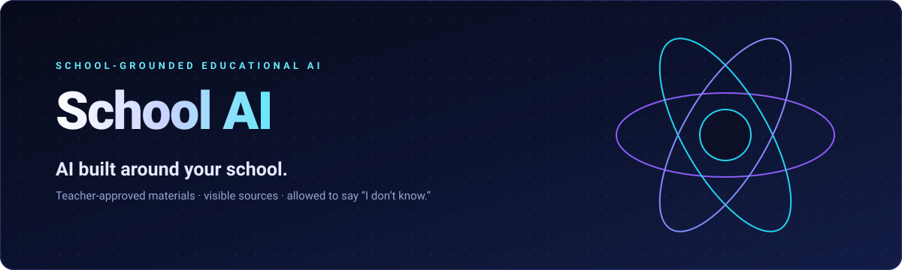
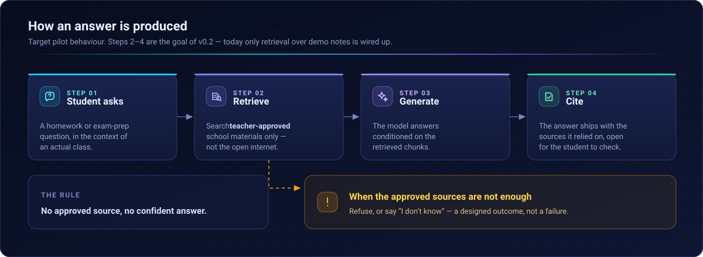
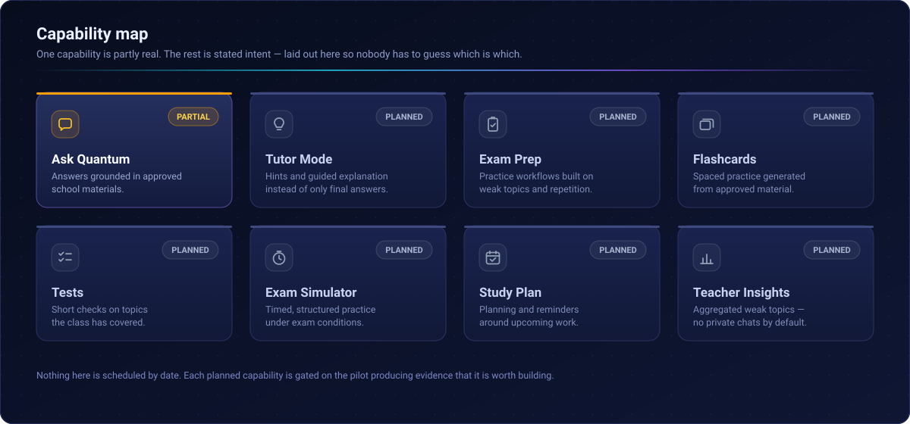
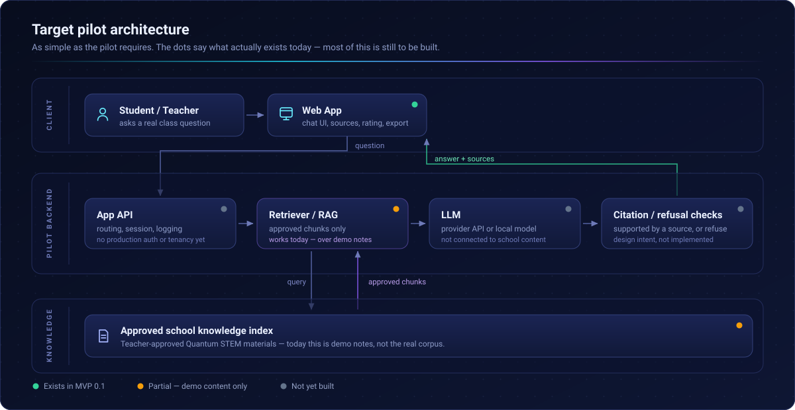
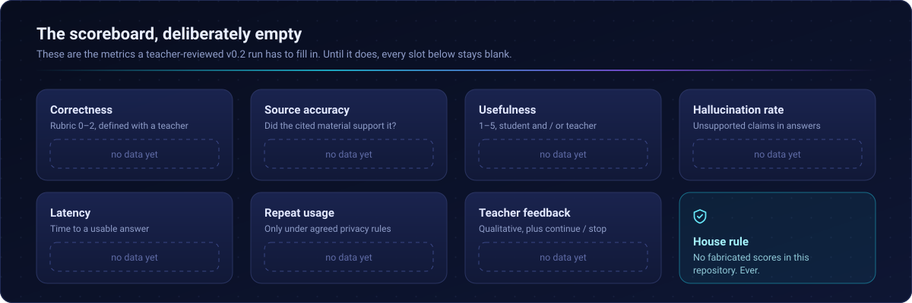
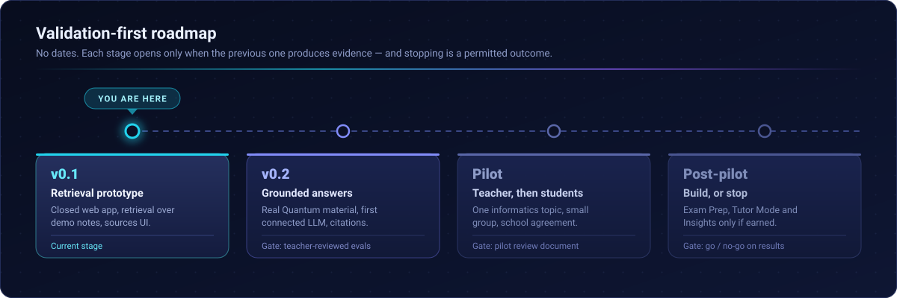
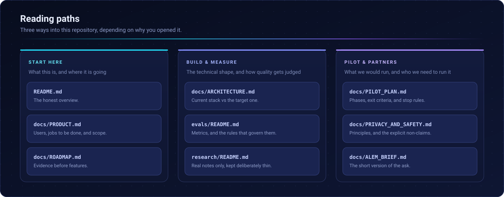

<div align="center">



<br>

<p align="center">
  <a href="docs/ROADMAP.md"></a>
  <a href="#current-mvp"></a>
  <a href="docs/ARCHITECTURE.md"></a><br>
  <a href="#current-status"></a>
  <a href="LICENSE"></a>
</p>

<p align="center"><strong>English</strong> · <a href="https://github.com/sazmak/Quantum.Ai/blob/readme-visual-identity/README.ru.md">Русский</a> · <a href="https://github.com/sazmak/Quantum.Ai/blob/readme-visual-identity/README.kk.md">Қазақша</a></p>

<p align="center"><a href="https://quantum-ai.grok.me/"><strong>LIVE DEMO</strong></a> · <a href="https://sazmak.github.io/Quantum.Ai/"><strong>LANDING</strong></a></p>

**[Overview](#overview)** · **[How it works](#how-it-works)** · **[Current MVP](#current-mvp)** · **[Architecture](#architecture)** · **[Pilot](#pilot)** · **[Evaluation](#evaluation)** · **[Roadmap](#roadmap)** · **[Partnership](#partnership)**

</div>

---

> [!IMPORTANT]
> **Status: Technical MVP → Pre-pilot.** Not production. Not validated at scale. Not claiming product–market fit.
>
> **Live MVP:** [quantum-ai.grok.me](https://quantum-ai.grok.me/)
>
> **Landing page:** [sazmak.github.io/Quantum.Ai](https://sazmak.github.io/Quantum.Ai/)

## Overview

Students already use generic AI tools for homework and exam prep. Those tools do not know a school's curriculum, approved notes, or how teachers expect topics to be explained.

School AI explores a narrower approach: **retrieve from approved school knowledge first, then generate an answer with sources.** Instead of answering from the open internet, it is designed to ground responses in teacher-approved learning materials from one school, with visible sources and a clear path to refuse when those sources are insufficient.

The product is intentionally scoped to **one school at a time**. The first deployment is **Quantum AI** for **Quantum STEM School**.

## How it works



The rule that shapes everything else: **no approved source, no confident answer.** Refusing is a designed outcome, not a failure.

> [!NOTE]
> Steps 2–4 describe the **target** pilot behaviour. Today, only retrieval over demo notes is wired up. Source-grounded LLM answers on real Quantum materials are the goal of **v0.2**.

## First deployment: Quantum AI

Starting with a single school keeps the knowledge base small, auditable, and aligned with real classes. Quantum STEM is the first pilot target because it offers a concrete informatics curriculum, identifiable teachers, and a controlled setting to test whether school-grounded answers are more useful than a generic chatbot.

> [!WARNING]
> No formal partnership agreement is claimed in this repository. Pilot collaboration with Quantum STEM is what we are **working toward**.

## Problem

The following are **hypotheses to validate**, not proven facts:

| ID | Hypothesis |
| :--- | :--- |
| **H1** | Generic AI lacks the context of a specific school's materials and teaching approach. |
| **H2** | Students already use AI for homework and exam preparation outside class. |
| **H3** | Teacher-approved materials plus citations can make AI more useful and more controllable for a school. |
| **H4** | Exam preparation (practice, weak topics, repetition) may become the main recurring use case. |
| **H5** | A school-scoped RAG system can outperform generic chatbots for school workflows when materials are available. |

We will not claim learning improvement, adoption, or superiority over ChatGPT until independent evaluation and teacher feedback support it.

## Product



Directions under consideration — not all are in the current MVP:

| Capability | Intent | MVP 0.1 |
| :--- | :--- | :--- |
| **Ask Quantum** | Student asks questions; answers grounded in approved school materials | 🟠 Partial (demo notes / prototype UX) |
| **Tutor Mode** | Hints and guided explanation instead of only final answers | ⚪ Not implemented |
| **Exam Prep** | Practice workflows for exams | ⚪ Not implemented |
| **Flashcards** | Spaced practice from approved material | ⚪ Not implemented |
| **Tests** | Short checks on covered topics | ⚪ Not implemented |
| **Exam Simulator** | Timed / structured exam practice | ⚪ Not implemented |
| **Study Plan / Reminders** | Planning and nudges | ⚪ Not implemented |
| **Teacher Insights** | Aggregated weak topics / repeated questions (no private chats by default) | ⚪ Not implemented |

See **[docs/PRODUCT.md](docs/PRODUCT.md)** for users, jobs-to-be-done, and explicit out-of-scope items.

## Current MVP

<table>
<tr>
<td width="50%" valign="top">

### ✅ Implemented — technical MVP 0.1

- Closed web prototype with chat UI
- Search / retrieval over **demo notes** *(not yet the approved Quantum STEM corpus)*
- Openable sources in the UI
- Usefulness rating
- Session export

</td>
<td width="50%" valign="top">

### ⬜ Not yet implemented / not validated

- Connected production-grade **LLM** answers on real school content
- **Approved Quantum STEM** materials as the knowledge base
- Browser QA with real students
- Independent teacher evaluation
- Tutor Mode, Exam Prep suite, Teacher Insights

</td>
</tr>
</table>

> [!NOTE]
> **Honest label:** MVP 0.1 is a retrieval-oriented prototype with demo content. Source-grounded LLM answers on real Quantum materials are the goal of **v0.2**.

### Repository scope

This public repository contains the landing page, pre-pilot documentation, evaluation notes, research notes, and project issues. **Application source is currently private; this repository contains public pre-pilot documentation and landing.**

## Architecture



- **Current (0.1)** — Web app + retrieval over demo notes; the LLM path is not validated as a connected school pilot stack.
- **Target pilot** — Approved Quantum materials → retrieve → generate with citations → refuse when sources are insufficient.

Details and local vs cloud trade-offs: **[docs/ARCHITECTURE.md](docs/ARCHITECTURE.md)**.

## Pilot

Proposed first pilot at **Quantum STEM**, subject to school agreement:

| | |
| :--- | :--- |
| **Subject** | Informatics — start small |
| **Teachers** | 1–2 |
| **Students** | Small group |
| **Materials** | Teacher-approved only |
| **Benchmark** | Independent question set |
| **Feedback** | Structured, from students *and* teachers |

Full phases, exit criteria, and stop rules: **[docs/PILOT_PLAN.md](docs/PILOT_PLAN.md)**.

## Evaluation



Planned metrics — **no fabricated scores in this repo**:

| Metric | Notes |
| :--- | :--- |
| Correctness | Rubric, e.g. 0–2 |
| Source accuracy | Did the cited material actually support the answer? |
| Usefulness | 1–5 |
| Hallucination / error rate | Unsupported claims |
| Latency | Time to answer |
| Repeat usage | Only if logged ethically |
| Teacher feedback | Qualitative, plus continue / stop |

Eval harness notes: **[evals/README.md](evals/README.md)**.

## Privacy

Baseline principles for pre-pilot work:

- **Data minimization**
- Prefer approved educational materials over scraping student PII
- Anonymized / teacher-provided test questions for early eval
- No unnecessary student identifiers
- Expanded student pilot **only after** school agreement and a clear data policy

Full principles: **[docs/PRIVACY_AND_SAFETY.md](docs/PRIVACY_AND_SAFETY.md)**.

## Current status

```text
Concept  →  Technical MVP  →  Pre-pilot  →  (later) Pilot results
                  ▲
              you are here
```

| Claim | Status |
| :--- | :--- |
| Working closed prototype | ✅ Yes — demo notes |
| Real Quantum corpus + LLM pilot | ⬜ Not yet |
| Production deployment | ❌ No |
| Validated learning outcomes | ❌ No |
| Product–market fit | ❌ Not claimed |

## Roadmap



| Stage | Focus |
| :--- | :--- |
| **v0.1** | Technical retrieval prototype *(current)* |
| **v0.2** | Real Quantum material + connected LLM + source-grounded answers |
| **Pilot** | Teacher + limited students under school agreement |
| **Post-pilot** | Exam Prep / Tutor / Teacher Insights **only if** results justify build |

Full sequence: **[docs/ROADMAP.md](docs/ROADMAP.md)**.

## Partnership

**We are currently looking for:**

- 🏫 Quantum STEM pilot collaboration
- 🧭 ALEM AI mentorship and technical review
- ⚙️ Model / compute infrastructure guidance
- 🔬 AI/ML expertise for RAG evaluation and safe school deployment

ALEM-oriented brief: **[docs/ALEM_BRIEF.md](docs/ALEM_BRIEF.md)**.

> We are not asking for hardware for its own sake. Infrastructure should follow a measured pilot plan.

## Founder

**Sanzhar Oral** · Astana, Kazakhstan

Building School AI and leading the proposed Quantum STEM pilot.

GitHub: [@sazmak](https://github.com/sazmak)

## Documentation



| Doc | Purpose |
| :--- | :--- |
| [docs/PRODUCT.md](docs/PRODUCT.md) | Users, JTBD, scope |
| [docs/ARCHITECTURE.md](docs/ARCHITECTURE.md) | Current vs target architecture |
| [docs/PILOT_PLAN.md](docs/PILOT_PLAN.md) | Quantum STEM pilot phases |
| [docs/ROADMAP.md](docs/ROADMAP.md) | Validation-first roadmap |
| [docs/PRIVACY_AND_SAFETY.md](docs/PRIVACY_AND_SAFETY.md) | Privacy & safety principles |
| [docs/ALEM_BRIEF.md](docs/ALEM_BRIEF.md) | Short brief for ALEM AI Talent Lab |
| [research/README.md](research/README.md) | Research notes home |
| [evals/README.md](evals/README.md) | Evaluation approach |

## Contributing / issues

Open GitHub Issues for pilot tasks, bugs, and docs. Templates live in [`.github/ISSUE_TEMPLATE/`](.github/ISSUE_TEMPLATE/).

Priority pre-pilot themes:

1. First approved Quantum STEM informatics material
2. 5–10 teacher-provided student questions
3. Connect first real LLM
4. Independent 30–50 question eval set
5. Privacy / data policy with the school
6. Exam Prep only after core validation

## License

Source and materials in this repository are **All Rights Reserved** until a public open-source license is explicitly chosen. See [LICENSE](LICENSE).

---

<div align="center">


**School AI / Quantum AI**

Pre-pilot documentation for discussion with educators and technical partners.

</div>
