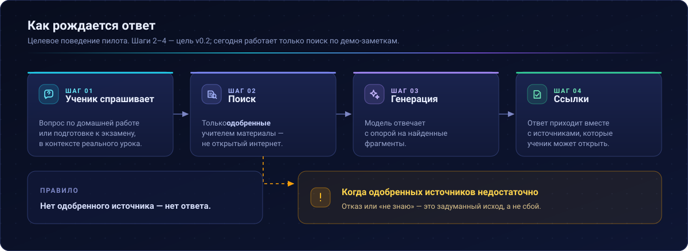
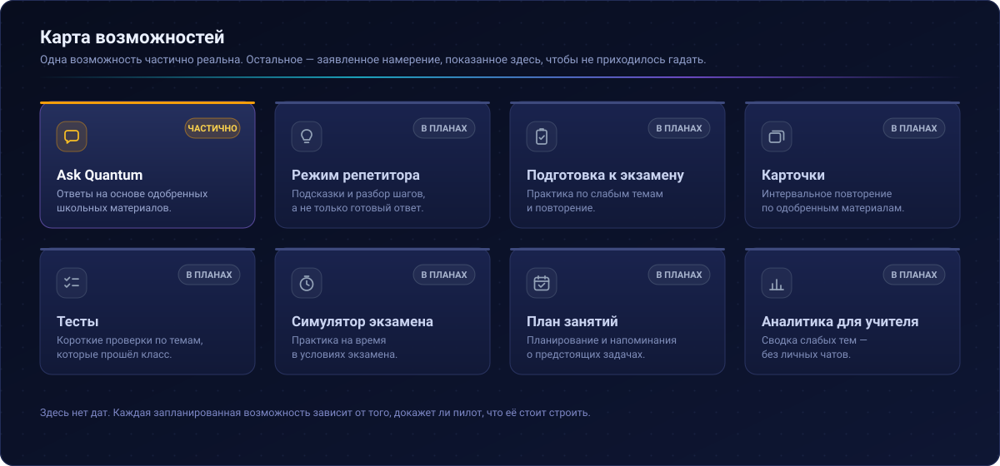
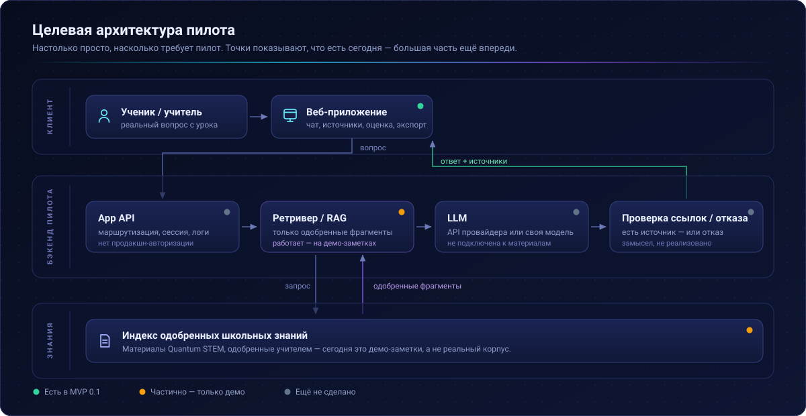
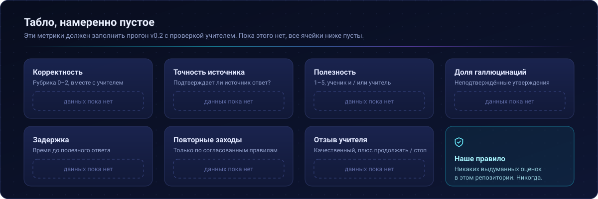
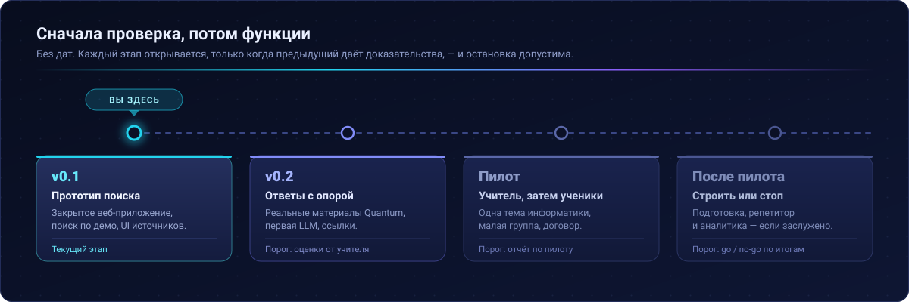
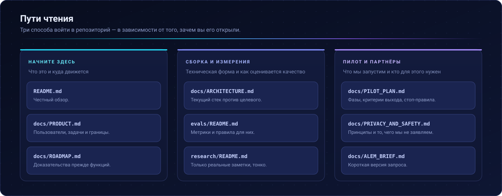

<div align="center">



<br>

[](docs/ROADMAP.md)
[](#текущий-mvp)
[](docs/ARCHITECTURE.md)
[](#текущий-статус)
[](LICENSE)

[English](README.md) · **Русский** · [Қазақша](README.kk.md)

**[Обзор](#обзор)** · **[Как это работает](#как-это-работает)** · **[Текущий MVP](#текущий-mvp)** · **[Архитектура](#архитектура)** · **[Пилот](#пилот)** · **[Оценка](#оценка)** · **[Дорожная карта](#дорожная-карта)** · **[Партнёрство](#партнёрство)**

</div>

---

> [!IMPORTANT]
> **Статус: технический MVP → предпилот.** Не продакшн. Не проверено на масштабе. Product–market fit не заявляется.
>
> **Закрытый тестовый прототип (не продакшн):** [демо school-ai-lab](https://school-ai-lab.proud-spice-8211.chatgpt.site)

## Обзор

Школьники уже пользуются обычными ИИ-инструментами для домашних заданий и подготовки к экзаменам. Эти инструменты не знают программу конкретной школы, одобренные учителем конспекты и то, как в школе принято объяснять тему.

School AI пробует более узкий подход: **сначала найти в одобренных школьных знаниях, затем сформировать ответ с источниками.** Вместо ответа из открытого интернета система опирается на учебные материалы одной школы, одобренные учителем, показывает источники и имеет явный путь к отказу, когда этих материалов недостаточно.

Продукт намеренно ограничен **одной школой за раз**. Первое внедрение — **Quantum AI** для **школы Quantum STEM**.

## Как это работает



Правило, из которого следует всё остальное: **нет одобренного источника — нет уверенного ответа.** Отказ здесь — задуманный исход, а не сбой.

> [!NOTE]
> Шаги 2–4 описывают **целевое** поведение пилота. Сегодня работает только поиск по демо-заметкам. Ответы с опорой на реальные материалы Quantum — цель **v0.2**.

## Первое внедрение: Quantum AI

Старт с одной школы позволяет держать базу знаний небольшой, проверяемой и совпадающей с реальными уроками. Quantum STEM выбран первой целью пилота, потому что там есть конкретная программа по информатике, известные учителя и контролируемая среда, где можно проверить, действительно ли ответы на школьных материалах полезнее обычного чат-бота.

> [!WARNING]
> Никакого формального соглашения о партнёрстве в этом репозитории не заявляется. Сотрудничество по пилоту с Quantum STEM — это то, к чему мы **идём**.

## Проблема

Ниже — **гипотезы для проверки**, а не доказанные факты:

| ID | Гипотеза |
| :--- | :--- |
| **H1** | Обычному ИИ не хватает контекста материалов и подхода конкретной школы. |
| **H2** | Ученики уже используют ИИ для домашних заданий и подготовки к экзаменам вне класса. |
| **H3** | Одобренные учителем материалы вместе со ссылками делают ИИ полезнее и управляемее для школы. |
| **H4** | Подготовка к экзаменам (практика, слабые темы, повторение) может стать основным повторяющимся сценарием. |
| **H5** | RAG-система в рамках одной школы может превзойти обычные чат-боты в школьных задачах, когда материалы доступны. |

Мы не будем заявлять об улучшении обучения, о внедрении или о превосходстве над ChatGPT, пока это не подтвердят независимая оценка и отзывы учителей.

## Продукт



Рассматриваемые направления — не все входят в текущий MVP:

| Возможность | Замысел | MVP 0.1 |
| :--- | :--- | :--- |
| **Ask Quantum** | Ученик задаёт вопросы; ответы опираются на одобренные школьные материалы | 🟠 Частично (демо-заметки / прототип UX) |
| **Режим репетитора** | Подсказки и разбор шагов вместо только готового ответа | ⚪ Не реализовано |
| **Подготовка к экзамену** | Практические сценарии для экзаменов | ⚪ Не реализовано |
| **Карточки** | Интервальное повторение по одобренным материалам | ⚪ Не реализовано |
| **Тесты** | Короткие проверки по пройденным темам | ⚪ Не реализовано |
| **Симулятор экзамена** | Практика на время / по структуре экзамена | ⚪ Не реализовано |
| **План занятий / напоминания** | Планирование и напоминания | ⚪ Не реализовано |
| **Аналитика для учителя** | Сводка слабых тем / повторяющихся вопросов (без личных чатов по умолчанию) | ⚪ Не реализовано |

Пользователи, задачи и явные границы — в **[docs/PRODUCT.md](docs/PRODUCT.md)**.

## Текущий MVP

<table>
<tr>
<td width="50%" valign="top">

### ✅ Реализовано — технический MVP 0.1

- Закрытый веб-прототип с чат-интерфейсом
- Поиск по **демо-заметкам** *(пока не по одобренному корпусу Quantum STEM)*
- Открываемые источники в интерфейсе
- Оценка полезности
- Экспорт сессии

</td>
<td width="50%" valign="top">

### ⬜ Пока не реализовано / не проверено

- Подключённая **LLM** продакшн-уровня на реальных школьных материалах
- **Одобренные материалы Quantum STEM** как база знаний
- Проверка в браузере с реальными учениками
- Независимая оценка учителем
- Режим репетитора, набор для подготовки к экзаменам, аналитика для учителя

</td>
</tr>
</table>

> [!NOTE]
> **Честная формулировка:** MVP 0.1 — это прототип, ориентированный на поиск, с демо-контентом. Ответы с опорой на реальные материалы Quantum — цель **v0.2**.

## Архитектура



- **Сейчас (0.1)** — веб-приложение и поиск по демо-заметкам; путь через LLM не проверен как связный школьный пилотный стек.
- **Целевой пилот** — одобренные материалы Quantum → поиск → генерация со ссылками → отказ, когда источников недостаточно.

Детали и компромиссы «локально или облако»: **[docs/ARCHITECTURE.md](docs/ARCHITECTURE.md)**.

## Пилот

Предлагаемый первый пилот в **Quantum STEM**, при условии согласия школы:

| | |
| :--- | :--- |
| **Предмет** | Информатика — начать с малого |
| **Учителя** | 1–2 |
| **Ученики** | Небольшая группа |
| **Материалы** | Только одобренные учителем |
| **Бенчмарк** | Независимый набор вопросов |
| **Обратная связь** | Структурированная, от учеников *и* учителей |

Полные фазы, критерии выхода и стоп-правила: **[docs/PILOT_PLAN.md](docs/PILOT_PLAN.md)**.

## Оценка



Планируемые метрики — **никаких выдуманных оценок в этом репозитории**:

| Метрика | Примечание |
| :--- | :--- |
| Корректность | Рубрика, например 0–2 |
| Точность источника | Действительно ли процитированный материал подтверждает ответ? |
| Полезность | 1–5 |
| Доля галлюцинаций / ошибок | Неподтверждённые утверждения |
| Задержка | Время до ответа |
| Повторные заходы | Только при этичном логировании |
| Отзыв учителя | Качественный, плюс «продолжать / стоп» |

Заметки по харнессу оценки: **[evals/README.md](evals/README.md)**.

## Приватность

Базовые принципы предпилотной работы:

- **Минимизация данных**
- Предпочитать одобренные учебные материалы вместо сбора персональных данных учеников
- Анонимизированные / предоставленные учителем вопросы для ранней оценки
- Никаких лишних идентификаторов учеников
- Расширенный пилот с учениками — **только после** соглашения со школой и понятной политики данных

Полные принципы: **[docs/PRIVACY_AND_SAFETY.md](docs/PRIVACY_AND_SAFETY.md)**.

## Текущий статус

```text
Идея  →  Технический MVP  →  Предпилот  →  (позже) Результаты пилота
                 ▲
             вы здесь
```

| Утверждение | Статус |
| :--- | :--- |
| Работающий закрытый прототип | ✅ Да — на демо-заметках |
| Реальный корпус Quantum + пилот с LLM | ⬜ Пока нет |
| Продакшн-развёртывание | ❌ Нет |
| Подтверждённые результаты обучения | ❌ Нет |
| Product–market fit | ❌ Не заявляется |

## Дорожная карта



| Этап | Фокус |
| :--- | :--- |
| **v0.1** | Технический прототип поиска *(сейчас)* |
| **v0.2** | Реальные материалы Quantum + подключённая LLM + ответы с источниками |
| **Пилот** | Учитель и ограниченная группа учеников по соглашению со школой |
| **После пилота** | Подготовка к экзаменам / репетитор / аналитика — **только если** результаты это оправдают |

Полная последовательность: **[docs/ROADMAP.md](docs/ROADMAP.md)**.

## Партнёрство

**Сейчас мы ищем:**

- 🏫 Сотрудничество по пилоту с Quantum STEM
- 🧭 Менторство и технический разбор от ALEM AI
- ⚙️ Рекомендации по моделям и вычислительной инфраструктуре
- 🔬 Экспертизу в AI/ML для оценки RAG и безопасного внедрения в школе

Бриф для ALEM: **[docs/ALEM_BRIEF.md](docs/ALEM_BRIEF.md)**.

> Мы не просим железо ради железа. Инфраструктура должна следовать за измеримым планом пилота.

## Документация



> [!NOTE]
> Файлы в `docs/`, `evals/` и `research/` пока существуют только на английском. Переведены README и все диаграммы.

| Документ | Назначение |
| :--- | :--- |
| [docs/PRODUCT.md](docs/PRODUCT.md) | Пользователи, задачи, границы |
| [docs/ARCHITECTURE.md](docs/ARCHITECTURE.md) | Текущая и целевая архитектура |
| [docs/PILOT_PLAN.md](docs/PILOT_PLAN.md) | Фазы пилота в Quantum STEM |
| [docs/ROADMAP.md](docs/ROADMAP.md) | Дорожная карта «сначала проверка» |
| [docs/PRIVACY_AND_SAFETY.md](docs/PRIVACY_AND_SAFETY.md) | Принципы приватности и безопасности |
| [docs/ALEM_BRIEF.md](docs/ALEM_BRIEF.md) | Короткий бриф для ALEM AI Talent Lab |
| [research/README.md](research/README.md) | Дом для исследовательских заметок |
| [evals/README.md](evals/README.md) | Подход к оценке |

## Участие / issues

Открывайте GitHub Issues для задач пилота, багов и документации. Шаблоны лежат в [`.github/ISSUE_TEMPLATE/`](.github/ISSUE_TEMPLATE/).

Приоритетные предпилотные темы:

1. Первый одобренный материал по информатике Quantum STEM
2. 5–10 вопросов учеников, предоставленных учителем
3. Подключить первую реальную LLM
4. Независимый набор из 30–50 вопросов для оценки
5. Политика приватности и данных вместе со школой
6. Подготовка к экзаменам — только после проверки базового качества

## Лицензия

Исходники и материалы этого репозитория — **все права защищены**, пока публичная open-source лицензия не выбрана явно. См. [LICENSE](LICENSE).

---

<div align="center">


**School AI / Quantum AI**

Предпилотная документация для обсуждения с педагогами и техническими партнёрами.

</div>
