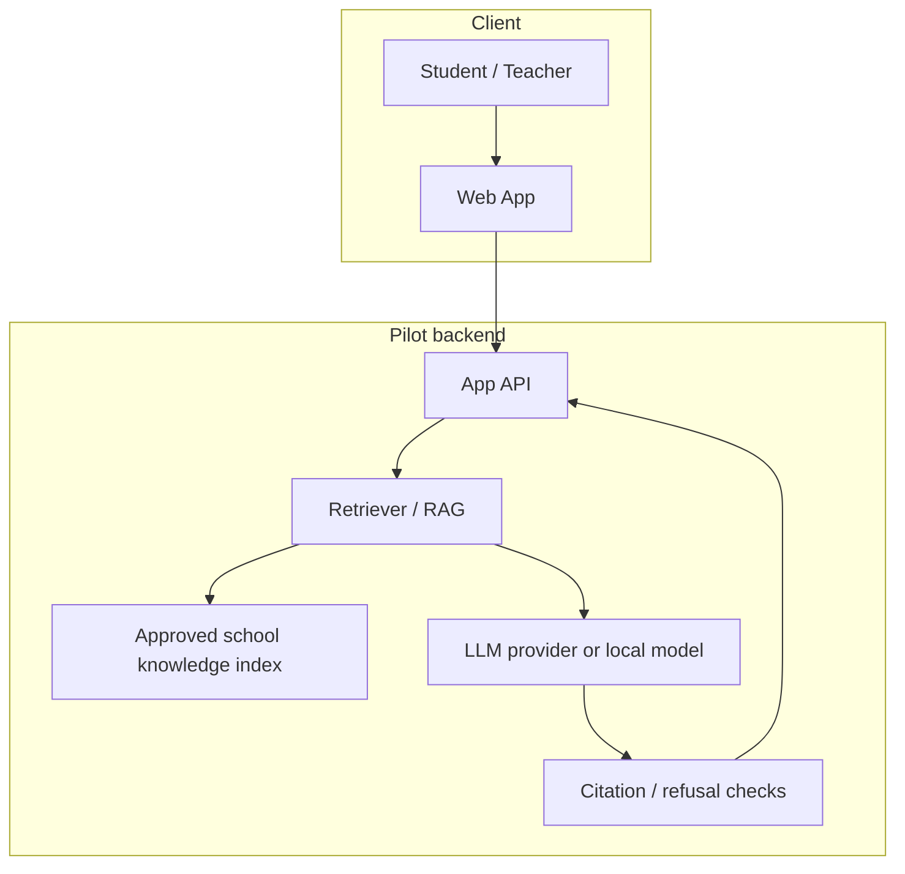

# Architecture

Keep the architecture as simple as the pilot requires. No microservices or Kubernetes designs until operational need is proven.

## Current — technical MVP 0.1

**Fact**

- Closed web application prototype
- Chat UI
- Retrieval / search over **demo notes**
- UI support for opening sources
- Usefulness rating and session export
- Hosted closed test: https://school-ai-lab.proud-spice-8211.chatgpt.site (not production)

**Not yet part of a validated pilot stack**

- Approved Quantum STEM corpus
- Connected LLM evaluated on that corpus
- Production auth, tenancy, or school SSO
- Formal observability / eval pipeline in CI

```text
Student → Web App → Retrieval (demo notes) → Answer UI (+ sources UX)
```

## Target pilot architecture



Intended behavior:

1. Retrieve relevant chunks from **approved** materials only
2. Generate an answer conditioned on those chunks
3. Attach sources
4. Refuse or say "I don't know" when retrieval is insufficient
5. Log eval signals needed for quality review (with privacy constraints)

## Local vs cloud

No final hosting decision is locked. Trade-offs to test during v0.2:

| Dimension | Local / on-prem leaning | Cloud API leaning |
| --- | --- | --- |
| Privacy | Stronger control of prompts and logs | Depends on vendor DPA / region |
| Cost | CapEx / GPU time; cheaper at steady load if hardware exists | Pay per token; low setup cost |
| Latency | Depends on local hardware | Often good; network dependent |
| GPU / VRAM | Must size model to available VRAM | Provider handles serving |
| Complexity | Ops burden on the team | Faster to connect first LLM |

**Principle:** choose the simplest option that satisfies the school's privacy bar and lets us measure answer quality quickly. Revisit after the first eval set, not before.

## Non-goals (architecture)

- Multi-region active-active
- Custom training of large foundation models as a prerequisite for pilot
- Complex agent meshes before basic RAG quality is measured
